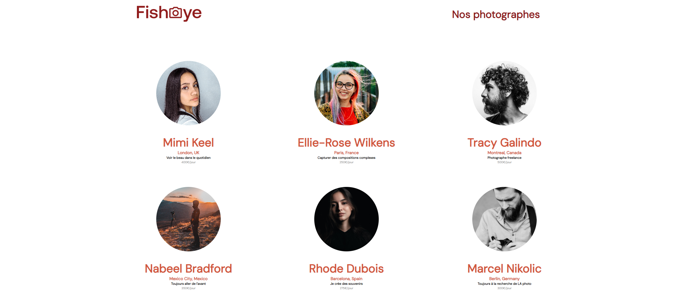

# FISHEYE

![html][html5-badge]
![css][css3-badge]
![javascript][javascript-badge]

### Description

FishEye est un site web qui permet aux photographes indépendants de présenter leurs meilleurs travaux. Ils ont récemment levé des fonds et aimeraient mettre à jour leur site web.

### Objectif

- Créer l’application web complète en respectant la maquette et les fonctionnalités souhaités
- Gérer la redirection vers les pages des photographes en utilisant JavaScript
- Gérer l'accessibilité pour les utilisateurs malvoyants, utiliations des commandes clavier pour naviguer sur le site
- Transactions - Spécifier les endpoints d’API nécessaires pour une éventuelle deuxième mission une fois l'objectif précedent validé.

### Ressources

- [Maquette](https://www.figma.com/file/Q3yNeD7WTK9QHDldg9vaRl/UI-Design-FishEye-FR?type=design&node-id=0-1&mode=design)

## Installation

- Forker puis cloner le repository à l'adresse suivante :
  `git clone https://github.com/afarkhsi/Front-End-Fisheye.git`
- Lancer l'application avec l'extension live server

<!-- BADGE LINKS -->

[html5-badge]: https://img.shields.io/badge/HTML5-E34F26?style=for-the-badge&logo=html5&logoColor=white
[css3-badge]: https://img.shields.io/badge/CSS3-1572B6?style=for-the-badge&logo=css3&logoColor=white
[javascript-badge]: https://img.shields.io/badge/JavaScript-F7DF1E?style=for-the-badge&logo=javascript&logoColor=black
[react-badge]: https://img.shields.io/badge/React-20232A?style=for-the-badge&logo=react&logoColor=61DAFB
[redux-badge]: https://img.shields.io/badge/Redux-20232A?style=for-the-badge&logo=redux&logoColor=61DAFB
